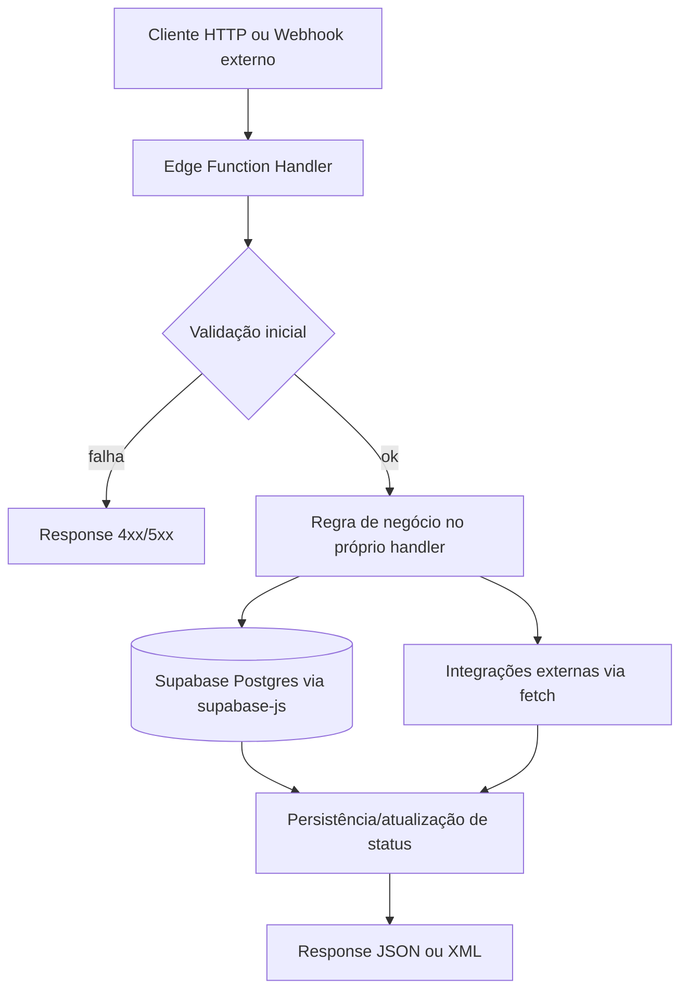
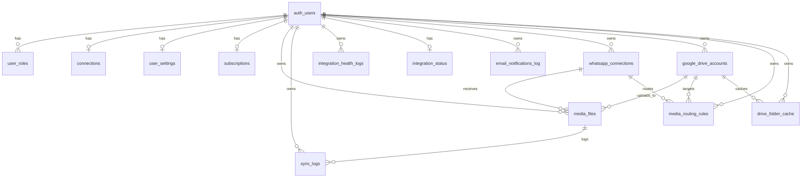
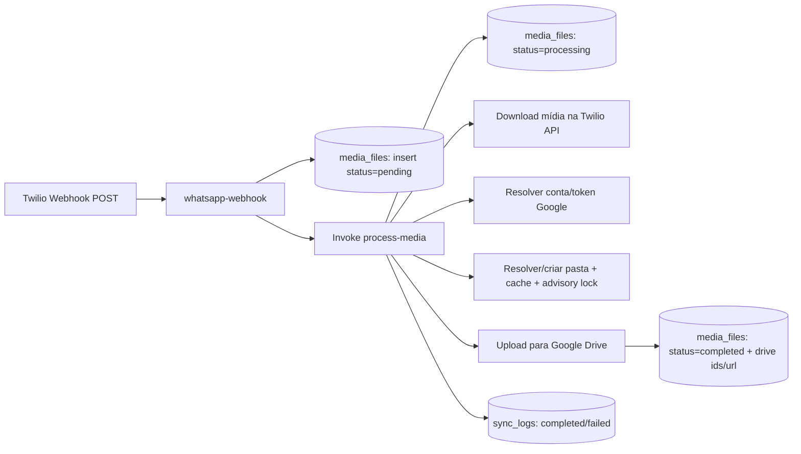

# Documentação Técnica Completa - Backend e Banco de Dados

## 1) Visão Geral da Arquitetura Backend

## Arquitetura geral

- **Estilo atual:** backend **serverless** com **Supabase Edge Functions** (Deno) + PostgreSQL Supabase.
- **Modelo de deploy:** funções independentes por caso de uso, expostas em `/functions/v1/{function-name}`.
- **Frontend separado:** aplicação React/Vite consome Edge Functions e tabelas Supabase diretamente.
- **Conclusão arquitetural:** não é monólito clássico com camadas explícitas de `controller/service/repository`; é um conjunto de funções HTTP orientadas a tarefa.

## Estrutura por camadas (como existe hoje)

- **Camada de entrada HTTP:** cada `index.ts` de `supabase/functions/*` atua como handler HTTP.
- **Camada de aplicação (implícita):** regras de negócio dentro das próprias funções (sem separação formal em classes/serviços).
- **Camada de acesso a dados:** uso de `@supabase/supabase-js` para CRUD e RPC (`rpc('pg_advisory_lock')`, por exemplo).
- **Integrações externas:** chamadas diretas com `fetch` para Twilio, Google APIs e Resend.

## Padrões identificados

- **Function-per-use-case:** cada endpoint representa um caso de uso (ex.: `process-media`, `google-oauth`).
- **Pipeline assíncrono por evento:** webhook (`whatsapp-webhook`) insere registro e dispara processamento (`process-media`).
- **Idempotência parcial:** proteção contra duplicidade em webhook via chave de mensagem e índices únicos.
- **Estado baseado em tabelas:** uso de colunas `status`/timestamps para orquestrar fluxo.
- **RLS como boundary de segurança de dados:** policies por `auth.uid()` e permissões de `service_role`.

## Request lifecycle (estado atual)

## Observações para migração NestJS

- **Não existem controllers/services/repositories formais** no código atual.
- Na reconstrução em NestJS, será necessário **extrair regras embutidas nos handlers** para serviços de domínio.
- Há pontos com responsabilidades misturadas (autenticação, integração externa, persistência e tratamento de erro no mesmo arquivo).

---

## 2) Domínios de Negócio (módulos funcionais)

## 2.1 Identity, Roles e Controle de Acesso

- Tabelas: `user_roles`, políticas RLS em várias tabelas.
- Responsabilidade:
  - associar papéis (`admin`/`user`) ao `auth.users`;
  - controlar escopo de leitura/escrita por usuário e por perfil admin.

## 2.2 Integrações WhatsApp (Twilio)

- Funções: `twilio-provision-number`, `twilio-deprovision-number`, `whatsapp-test-connection`, `whatsapp-verify-status`, `whatsapp-webhook`.
- Tabelas principais: `whatsapp_connections`, `connections` (legada).
- Responsabilidade:
  - provisionar/desprovisionar conexão WhatsApp;
  - validar credenciais Twilio;
  - receber webhooks de mídia e iniciar processamento.

## 2.3 Integrações Google Drive (OAuth + upload)

- Funções: `google-oauth`, `process-media`.
- Tabelas principais: `google_drive_accounts`, `connections`, `media_routing_rules`, `drive_folder_cache`.
- Responsabilidade:
  - fluxo OAuth (`authorize`, `callback`, `refresh`);
  - seleção de conta Google por regras de roteamento;
  - criação/uso de estrutura de pastas e upload de arquivos.

## 2.4 Processamento de Mídia e Sincronização

- Funções: `whatsapp-webhook`, `process-media`, `reprocess-media`.
- Tabelas principais: `media_files`, `sync_logs`.
- Responsabilidade:
  - registrar mídias recebidas;
  - processar upload para Drive;
  - controlar tentativas, falhas permanentes e reprocessamento.

## 2.5 Monitoramento de Saúde e Alertas

- Funções: `health-check`, `send-health-alert`.
- Tabelas principais: `integration_status`, `integration_health_logs`, `email_notifications_log`.
- Responsabilidade:
  - verificar saúde de integrações;
  - registrar estado consolidado;
  - enviar alertas por e-mail com cooldown.

## 2.6 Assinatura/Plano e Limites

- Tabela principal: `subscriptions`.
- Responsabilidade:
  - armazenar plano e limites (arquivos/mês, número de contas WhatsApp/Drive);
  - suportar contabilização de uso e aviso de consumo via `sync_logs`.

---

## 3) Endpoints de Backend (inventário completo encontrado)

Base: `https://{project-ref}.supabase.co/functions/v1`

- `POST /google-oauth`
- `POST /health-check`
- `POST /process-media`
- `POST /reprocess-media`
- `POST /send-health-alert`
- `POST /twilio-provision-number`
- `POST /twilio-deprovision-number`
- `POST /whatsapp-test-connection`
- `POST /whatsapp-verify-status`
- `GET /whatsapp-webhook`
- `POST /whatsapp-webhook`

Observações:

- Métodos `OPTIONS` também são tratados por CORS em múltiplas funções.
- Há uma entrada em `supabase/config.toml` para `whatsapp-embedded-signup`, mas **a função correspondente não foi encontrada** no diretório `supabase/functions` (**uncertain** sobre estado real em produção).

---

## 4) Documentação Completa do Banco de Dados

Esta seção consolida `supabase/sql/*.sql` (schema base + migrações complementares).

## 4.1 Enums

- `app_role`: `admin`, `user`
- `sync_status`: `pending`, `processing`, `completed`, `failed`
- `media_type`: `image`, `video`, `audio`, `document`
- `connection_status`: `connected`, `disconnected`, `pending`, `error`
- `plan_type`: `free`, `starter`, `pro`, `business`
- `health_check_type`: `whatsapp_token`, `whatsapp_webhook`, `google_token`, `google_api`, `media_processing`
- `health_status`: `healthy`, `warning`, `critical`, `unknown`

## 4.2 Tabelas (todas as identificadas)

### `user_roles`

- **PK:** `id`
- **FKs:** `user_id -> auth.users(id) ON DELETE CASCADE`
- **Unique:** `(user_id, role)`
- **Colunas:**
  - `id` UUID, not null, default `gen_random_uuid()`
  - `user_id` UUID, not null
  - `role` `app_role`, not null, default `'user'`
  - `created_at` TIMESTAMPTZ, nullable, default `now()`
- **Índices explícitos:** nenhum adicional (além de PK/unique implícitos)

### `connections` (legada/single-connection)

- **PK:** `id`
- **FKs:** `user_id -> auth.users(id) ON DELETE CASCADE`
- **Unique:** `(user_id)`
- **Colunas:**
  - `id` UUID, not null, default `gen_random_uuid()`
  - `user_id` UUID, not null
  - `whatsapp_phone_number_id` TEXT, nullable
  - `whatsapp_status` `connection_status`, nullable, default `'disconnected'`
  - `whatsapp_connected_at` TIMESTAMPTZ, nullable
  - `google_client_id` TEXT, nullable
  - `google_client_secret` TEXT, nullable
  - `google_redirect_uri` TEXT, nullable
  - `google_access_token` TEXT, nullable
  - `google_refresh_token` TEXT, nullable
  - `google_token_expires_at` TIMESTAMPTZ, nullable
  - `google_status` `connection_status`, nullable, default `'disconnected'`
  - `google_connected_at` TIMESTAMPTZ, nullable
  - `google_root_folder` TEXT, nullable, default `'/SwiftWapDrive'`
  - `twilio_account_sid` TEXT, nullable (migração Twilio)
  - `twilio_auth_token` TEXT, nullable (migração Twilio)
  - `twilio_whatsapp_number` TEXT, nullable (migração Twilio)
  - `created_at` TIMESTAMPTZ, nullable, default `now()`
  - `updated_at` TIMESTAMPTZ, nullable, default `now()`
- **Índices explícitos:**
  - `idx_connections_user_id (user_id)`

### `user_settings`

- **PK:** `id`
- **FKs:** `user_id -> auth.users(id) ON DELETE CASCADE`
- **Unique:** `(user_id)`
- **Colunas:**
  - `id` UUID, not null, default `gen_random_uuid()`
  - `user_id` UUID, not null
  - `auto_create_folders` BOOLEAN, nullable, default `true`
  - `organize_by_date` BOOLEAN, nullable, default `true`
  - `organize_by_type` BOOLEAN, nullable, default `true`
  - `organize_by_contact` BOOLEAN, nullable, default `false`
  - `max_file_size_mb` INTEGER, nullable, default `25`
  - `enable_notifications` BOOLEAN, nullable, default `true`
  - `auto_sync_enabled` BOOLEAN, nullable, default `true`
  - `sync_images` BOOLEAN, nullable, default `true`
  - `sync_videos` BOOLEAN, nullable, default `true`
  - `sync_audio` BOOLEAN, nullable, default `true`
  - `sync_documents` BOOLEAN, nullable, default `true`
  - `folder_structure` TEXT, nullable, default `'sender_date_type'` (default final após migração 014)
  - `notification_on_error` BOOLEAN, nullable, default `true`
  - `notification_on_success` BOOLEAN, nullable, default `false`
  - `created_at` TIMESTAMPTZ, nullable, default `now()`
  - `updated_at` TIMESTAMPTZ, nullable, default `now()`
- **Índices explícitos:** nenhum adicional

### `subscriptions`

- **PK:** `id`
- **FKs:** `user_id -> auth.users(id) ON DELETE CASCADE`
- **Unique:** `(user_id)`
- **Colunas:**
  - `id` UUID, not null, default `gen_random_uuid()`
  - `user_id` UUID, not null
  - `plan` `plan_type`, not null, default `'free'`
  - `status` TEXT, not null
  - `stripe_customer_id` TEXT, nullable
  - `stripe_subscription_id` TEXT, nullable
  - `current_period_end` TIMESTAMPTZ, nullable
  - `monthly_file_limit` INTEGER, nullable, default `200` (default final após migração 013)
  - `monthly_storage_mb` INTEGER, nullable
  - `files_used_current_month` INTEGER, nullable, default `0`
  - `whatsapp_numbers_limit` INTEGER, not null, default `1`
  - `google_accounts_limit` INTEGER, not null, default `1`
  - `overage_enabled` BOOLEAN, not null, default `true` (default final após migração 013)
  - `features` JSONB, not null, default `'{}'::jsonb`
  - `created_at` TIMESTAMPTZ, nullable, default `now()`
  - `updated_at` TIMESTAMPTZ, nullable, default `now()`
- **Índices explícitos:** nenhum adicional

### `media_files`

- **PK:** `id`
- **FKs:**
  - `user_id -> auth.users(id) ON DELETE CASCADE`
  - `whatsapp_connection_id -> whatsapp_connections(id) ON DELETE SET NULL`
  - `google_drive_account_id -> google_drive_accounts(id) ON DELETE SET NULL`
- **Unique:**
  - `(whatsapp_media_id, user_id)`
  - índice único parcial `idx_unique_whatsapp_message (whatsapp_message_id, user_id) WHERE whatsapp_message_id IS NOT NULL`
- **Colunas:**
  - `id` UUID, not null, default `gen_random_uuid()`
  - `user_id` UUID, not null
  - `whatsapp_connection_id` UUID, nullable
  - `google_drive_account_id` UUID, nullable
  - `whatsapp_media_id` TEXT, not null
  - `whatsapp_message_id` TEXT, nullable
  - `sender_phone` TEXT, nullable
  - `sender_name` TEXT, nullable
  - `file_name` TEXT, not null
  - `file_type` `media_type`, not null
  - `file_size_bytes` BIGINT, nullable
  - `mime_type` TEXT, nullable
  - `google_drive_file_id` TEXT, nullable
  - `google_drive_folder_id` TEXT, nullable
  - `google_drive_url` TEXT, nullable
  - `status` `sync_status`, nullable, default `'pending'`
  - `error_message` TEXT, nullable
  - `retry_count` INTEGER, nullable, default `0`
  - `is_permanent_failure` BOOLEAN, nullable, default `false`
  - `last_attempt_at` TIMESTAMPTZ, nullable
  - `received_at` TIMESTAMPTZ, nullable, default `now()`
  - `processed_at` TIMESTAMPTZ, nullable
  - `uploaded_at` TIMESTAMPTZ, nullable
  - `created_at` TIMESTAMPTZ, nullable, default `now()`
- **Índices explícitos:**
  - `idx_media_files_user_id (user_id)`
  - `idx_media_files_status (status)`
  - `idx_media_files_received_at (received_at DESC)`

### `sync_logs`

- **PK:** `id`
- **FKs:**
  - `user_id -> auth.users(id) ON DELETE CASCADE`
  - `media_file_id -> media_files(id) ON DELETE SET NULL`
- **Colunas:**
  - `id` UUID, not null, default `gen_random_uuid()`
  - `user_id` UUID, not null
  - `media_file_id` UUID, nullable
  - `action` TEXT, not null
  - `status` `sync_status`, not null
  - `message` TEXT, nullable
  - `metadata` JSONB, nullable
  - `source` TEXT, nullable, default `'system'`
  - `created_at` TIMESTAMPTZ, nullable, default `now()`
- **Índices explícitos:**
  - `idx_sync_logs_user_id (user_id)`
  - `idx_sync_logs_created_at (created_at DESC)`

### `integration_health_logs`

- **PK:** `id`
- **FKs:** `user_id -> auth.users(id) ON DELETE CASCADE`
- **Colunas:**
  - `id` UUID, not null, default `gen_random_uuid()`
  - `user_id` UUID, not null
  - `check_type` `health_check_type`, not null
  - `status` `health_status`, not null, default `'unknown'`
  - `message` TEXT, nullable
  - `metadata` JSONB, nullable
  - `created_at` TIMESTAMPTZ, nullable, default `now()`
- **Índices explícitos:**
  - `idx_health_logs_user_id (user_id)`
  - `idx_health_logs_created_at (created_at DESC)`
  - `idx_health_logs_check_type (check_type)`

### `integration_status`

- **PK:** `id`
- **FKs:** `user_id -> auth.users(id) ON DELETE CASCADE`
- **Unique:** `(user_id)`
- **Colunas:**
  - `id` UUID, not null, default `gen_random_uuid()`
  - `user_id` UUID, not null
  - `whatsapp_health` `health_status`, nullable, default `'unknown'`
  - `whatsapp_last_check` TIMESTAMPTZ, nullable
  - `whatsapp_message` TEXT, nullable
  - `google_health` `health_status`, nullable, default `'unknown'`
  - `google_last_check` TIMESTAMPTZ, nullable
  - `google_message` TEXT, nullable
  - `processing_health` `health_status`, nullable, default `'unknown'`
  - `processing_last_check` TIMESTAMPTZ, nullable
  - `processing_message` TEXT, nullable
  - `overall_status` `health_status`, nullable, default `'unknown'`
  - `created_at` TIMESTAMPTZ, nullable, default `now()`
  - `updated_at` TIMESTAMPTZ, nullable, default `now()`
- **Índices explícitos:** nenhum adicional além do unique

### `email_notifications_log`

- **PK:** `id`
- **FKs:** `user_id -> auth.users(id) ON DELETE CASCADE`
- **Colunas:**
  - `id` UUID, not null, default `gen_random_uuid()`
  - `user_id` UUID, not null
  - `alert_type` TEXT, not null
  - `service_name` TEXT, not null
  - `message` TEXT, not null
  - `email_to` TEXT, not null
  - `resend_id` TEXT, nullable
  - `sent_at` TIMESTAMPTZ, not null, default `now()`
  - `created_at` TIMESTAMPTZ, not null, default `now()`
- **Índices explícitos:**
  - `idx_email_notifications_cooldown (user_id, alert_type, sent_at DESC)`

### `whatsapp_connections`

- **PK:** `id`
- **FKs:** `user_id -> auth.users(id) ON DELETE CASCADE`
- **Unique/constraints:**
  - `UNIQUE(user_id, phone_number_id)`
  - índice único parcial `ux_whatsapp_connections_active_phone (phone_number_id) WHERE status IN ('connected','pending')`
  - índice único parcial `ux_whatsapp_connections_twilio_number_active (twilio_whatsapp_number) WHERE status IN ('connected','pending')`
- **Colunas:**
  - `id` UUID, not null, default `gen_random_uuid()`
  - `user_id` UUID, not null
  - `label` TEXT, nullable
  - `phone_number_id` TEXT, nullable (já foi NOT NULL no passado)
  - `status` `connection_status`, not null, default `'pending'`
  - `provider` TEXT, not null, default `'twilio'`
  - `twilio_account_sid` TEXT, nullable
  - `twilio_auth_token` TEXT, nullable
  - `twilio_subaccount_sid` TEXT, nullable
  - `twilio_subaccount_auth_token` TEXT, nullable
  - `twilio_whatsapp_number` TEXT, nullable
  - `twilio_number_sid` TEXT, nullable
  - `customer_phone_number` TEXT, nullable
  - `connected_at` TIMESTAMPTZ, nullable
  - `created_at` TIMESTAMPTZ, not null, default `now()`
  - `updated_at` TIMESTAMPTZ, not null, default `now()`
- **Índices explícitos:**
  - `idx_whatsapp_connections_user_id (user_id)`
  - `idx_whatsapp_connections_status (status)`
  - `idx_whatsapp_connections_twilio_number (twilio_whatsapp_number) WHERE twilio_whatsapp_number IS NOT NULL`
  - `idx_whatsapp_connections_customer_phone (customer_phone_number) WHERE customer_phone_number IS NOT NULL`

### `google_drive_accounts`

- **PK:** `id`
- **FKs:** `user_id -> auth.users(id) ON DELETE CASCADE`
- **Colunas:**
  - `id` UUID, not null, default `gen_random_uuid()`
  - `user_id` UUID, not null
  - `label` TEXT, nullable
  - `account_email` TEXT, nullable
  - `access_token` TEXT, nullable
  - `refresh_token` TEXT, nullable
  - `token_expires_at` TIMESTAMPTZ, nullable
  - `root_folder_path` TEXT, not null, default `'/SwiftWapDrive'`
  - `root_folder_id` TEXT, nullable
  - `status` `connection_status`, not null, default `'disconnected'`
  - `connected_at` TIMESTAMPTZ, nullable
  - `created_at` TIMESTAMPTZ, not null, default `now()`
  - `updated_at` TIMESTAMPTZ, not null, default `now()`
- **Índices explícitos:**
  - `idx_google_drive_accounts_user_id (user_id)`
  - `idx_google_drive_accounts_status (status)`

### `media_routing_rules`

- **PK:** `id`
- **FKs:**
  - `user_id -> auth.users(id) ON DELETE CASCADE`
  - `whatsapp_connection_id -> whatsapp_connections(id) ON DELETE CASCADE`
  - `google_drive_account_id -> google_drive_accounts(id) ON DELETE CASCADE`
- **Colunas:**
  - `id` UUID, not null, default `gen_random_uuid()`
  - `user_id` UUID, not null
  - `whatsapp_connection_id` UUID, not null
  - `google_drive_account_id` UUID, not null
  - `file_type` `media_type`, nullable
  - `is_default` BOOLEAN, not null, default `false`
  - `is_active` BOOLEAN, not null, default `true`
  - `created_at` TIMESTAMPTZ, not null, default `now()`
  - `updated_at` TIMESTAMPTZ, not null, default `now()`
- **Índices explícitos:**
  - `idx_media_routing_rules_user_id (user_id)`
  - `idx_media_routing_rules_whatsapp (whatsapp_connection_id)`

### `drive_folder_cache`

- **PK:** `id`
- **FKs:**
  - `user_id -> auth.users(id) ON DELETE CASCADE`
  - `google_account_id -> google_drive_accounts(id) ON DELETE CASCADE`
- **Unique:** `(user_id, google_account_id, folder_path)`
- **Colunas:**
  - `id` UUID, not null, default `gen_random_uuid()`
  - `user_id` UUID, not null
  - `google_account_id` UUID, nullable
  - `folder_path` TEXT, not null
  - `folder_id` TEXT, not null
  - `created_at` TIMESTAMPTZ, nullable, default `now()`
  - `updated_at` TIMESTAMPTZ, nullable, default `now()`
- **Índices explícitos:**
  - `idx_drive_folder_cache_lookup (user_id, google_account_id, folder_path)`

## 4.3 Funções e triggers SQL relevantes

- `update_updated_at_column()` trigger function (atualiza `updated_at`).
- `handle_new_user()` bootstrap de usuário (foi redefinida em migrações; versão final inclui `integration_status`).
- `has_role(_user_id, _role)` para policies de admin.
- `pg_advisory_lock(lock_key)` e `pg_advisory_unlock(lock_key)` wrappers `SECURITY DEFINER`.
- Triggers de `updated_at` em várias tabelas (`connections`, `user_settings`, `subscriptions`, `whatsapp_connections`, `google_drive_accounts`, `media_routing_rules`, `integration_status`).

---

## 5) Relacionamentos (completos)

## 5.1 Relações 1:N

- `auth.users (1) -> (N) user_roles`
- `auth.users (1) -> (N) media_files`
- `auth.users (1) -> (N) sync_logs`
- `auth.users (1) -> (N) integration_health_logs`
- `auth.users (1) -> (N) email_notifications_log`
- `auth.users (1) -> (N) whatsapp_connections`
- `auth.users (1) -> (N) google_drive_accounts`
- `auth.users (1) -> (N) media_routing_rules`
- `auth.users (1) -> (N) drive_folder_cache`

## 5.2 Relações 1:1 (impostas por UNIQUE em `user_id`)

- `auth.users (1) -> (0..1) connections`
- `auth.users (1) -> (0..1) user_settings`
- `auth.users (1) -> (0..1) subscriptions`
- `auth.users (1) -> (0..1) integration_status`

## 5.3 Relações entre entidades de integração

- `whatsapp_connections (1) -> (N) media_files` via `media_files.whatsapp_connection_id` (nullable)
- `google_drive_accounts (1) -> (N) media_files` via `media_files.google_drive_account_id` (nullable)
- `whatsapp_connections (1) -> (N) media_routing_rules`
- `google_drive_accounts (1) -> (N) media_routing_rules`
- `google_drive_accounts (1) -> (N) drive_folder_cache`

## 5.4 Many-to-many (modelada)

- Não há M:N explícita com tabela de junção dedicada apenas a relacionamento puro.
- `media_routing_rules` funciona como **entidade de roteamento** entre WhatsApp e Google Drive com atributos próprios (`file_type`, `is_default`, `is_active`), podendo ser vista como mapeamento N:N contextual.

## 5.5 ERD (Mermaid)

---

## 6) Fluxos de Dados Principais

## 6.1 Fluxo de upload/processamento de mídia (chave do sistema)

Etapas observadas:

1. Twilio envia `application/x-www-form-urlencoded` para `whatsapp-webhook`.
2. Função identifica `whatsapp_connections` ativa pelo número de destino (`To`).
3. Para cada mídia:
   - aplica idempotência (`whatsapp_message_id`);
   - insere em `media_files` com `status = pending`;
   - chama `process-media`.
4. `process-media`:
   - muda status para `processing`;
   - baixa arquivo na Twilio com credenciais resolvidas;
   - resolve conta Google por regra e fallback;
   - renova token se necessário;
   - usa cache de pastas + advisory lock para reduzir corrida;
   - faz upload no Google Drive;
   - atualiza `media_files` para `completed` (ou `failed` com retry).

## 6.2 Fluxo de OAuth Google

1. Frontend chama `google-oauth` com `action=authorize`.
2. Backend retorna `authUrl`.
3. Frontend recebe `code` no callback e chama `google-oauth` com `action=callback`.
4. Backend troca `code` por tokens na Google OAuth API.
5. Atualiza/insere `google_drive_accounts` e também `connections` (compatibilidade legada).
6. Para renovação, frontend/serviço chama `action=refresh`.

## 6.3 Fluxo de saúde e alertas

1. `health-check` avalia WhatsApp/Google/processamento por usuário.
2. Persiste logs em `integration_health_logs` e estado em `integration_status`.
3. Em criticidade, chama `send-health-alert`.
4. `send-health-alert` aplica cooldown (`email_notifications_log`) e envia via Resend.

## 6.4 Fluxo de criação de usuário (bootstrap)

1. Novo registro em `auth.users`.
2. Trigger `handle_new_user()` cria:
   - `user_roles` (`user`);
   - `user_settings`;
   - `connections`;
   - `subscriptions`;
   - `integration_status`.

---

## 7) Integrações Externas

## Twilio API

- Uso:
  - validar credenciais (`Accounts/{sid}.json`);
  - receber webhook de mídia;
  - (deprovision) suspender subaccount.
- Endpoints externos observados:
  - `https://api.twilio.com/2010-04-01/Accounts/...`
- Auth: Basic Auth (`sid:token`).

## Google APIs

- OAuth token exchange/refresh:
  - `https://oauth2.googleapis.com/token`
- Drive API:
  - `https://www.googleapis.com/drive/v3/about?...`
  - `https://www.googleapis.com/drive/v3/files...`
  - `https://www.googleapis.com/upload/drive/v3/files...`
- Auth: Bearer OAuth token.

## Resend API

- Uso: envio de e-mail de alertas críticos.
- Endpoint:
  - `https://api.resend.com/emails`
- Auth: Bearer (`RESEND_API_KEY`).

## Supabase Platform Integrations

- `supabase.functions.invoke()` entre funções (`whatsapp-webhook -> process-media`, `health-check -> send-health-alert`).
- `pg_cron` + `pg_net` para agendamento de `health-check` (arquivo `004_cron_health_check.sql`).
- **Risco identificado:** `004_cron_health_check.sql` contém URL e token hardcoded no script.

---

## 8) Upload de Arquivos e Tratamento de Mídia (IMPORTANTE)

## Como uploads são tratados

- O sistema **não recebe upload direto de cliente** para storage próprio.
- A mídia chega via webhook Twilio (`MediaUrlN`) e é baixada server-side por `process-media`.

## Validações e limites identificáveis

- Validações:
  - idempotência por `whatsapp_message_id` e índices únicos;
  - checagem de `mediaFileId` obrigatório em `process-media`/`reprocess-media`;
  - checagem de configurações de sincronização por tipo (`sync_images`, `sync_videos`, etc.);
  - checagem de estado de conexão e tokens.
- Limites:
  - plano (`subscriptions.monthly_file_limit`) é lido/atualizado em `process-media`.
  - `user_settings.max_file_size_mb` existe na tabela, mas **não foi encontrado uso direto no `process-media` atual** (**uncertain** se é aplicado em outro lugar/runtime externo).

## Estratégia de armazenamento

- Fonte primária: mídia em URL Twilio (temporária).
- Destino final: Google Drive (pasta calculada pela estratégia de organização).
- Metadados e rastreabilidade no Postgres:
  - `media_files` (estado, ids, URL Drive, retries),
  - `sync_logs` (auditoria de ações).

## Processamento síncrono/assíncrono

- `whatsapp-webhook` dispara `process-media` por mídia.
- O processamento é assíncrono em relação ao remetente externo (webhook responde XML).
- Controle de concorrência:
  - lock consultivo por usuário (`pg_advisory_lock`) ao resolver/criar pastas;
  - cache de pasta (`drive_folder_cache`) para evitar duplicação.

---

## 9) Segurança, Autenticação e RLS

## Autenticação HTTP nas funções

- Parte das funções valida `Authorization: Bearer ...` manualmente (`google-oauth`, `twilio-provision-number`, `twilio-deprovision-number`, `whatsapp-verify-status`).
- Outras funções são abertas/internas por design (`whatsapp-webhook`, `process-media`, `health-check`, `send-health-alert`).
- **Inconsistência observada:** `supabase/config.toml` marca `whatsapp-test-connection` com `verify_jwt = true`, porém o handler não valida usuário explicitamente. Dependência pode estar no gateway do Supabase; comportamento efetivo sem token é **uncertain** sem teste runtime.

## Segurança de dados (RLS)

- RLS ativado em tabelas principais.
- Policies por `auth.uid() = user_id`.
- Policies especiais:
  - `service_role` com acesso total em tabelas de processamento;
  - `anon` inserção em `media_files` e `sync_logs` (suporte webhook).
- Policies admin com `has_role(auth.uid(), 'admin')`.

---

## 10) Pontos de atenção para redesign em NestJS

- **Separar camadas**: `Controllers -> Application Services -> Domain Services -> Repositories`.
- **Criar filas explícitas** para processamento de mídia (ex.: BullMQ/SQS) em vez de acoplamento direto webhook->processamento.
- **Padronizar auth boundary**: centralizar guard JWT e escopos de acesso.
- **External clients isolados**: Twilio/Google/Resend como adapters dedicados.
- **Observabilidade**: padronizar logs estruturados e tracing de correlação por `media_file_id`.
- **Gestão de segredos**: remover tokens hardcoded de scripts SQL operacionais.

---

## 11) Itens Incertos (marcados explicitamente)

- `whatsapp-embedded-signup` aparece em configuração mas função não está no repositório atual.
- Comportamento efetivo de `verify_jwt` do gateway Supabase em cada função sem testes de execução.
- Valores reais de constraints adicionais não declaradas em SQL (ex.: eventuais constraints criadas manualmente fora de migrations).
- Possível uso de `max_file_size_mb` fora do backend atual (não identificado nas Edge Functions).

---

## 12) Referências de código (fontes analisadas)

- `supabase/functions/*/index.ts` (todas as funções existentes)
- `supabase/sql/001_create_tables.sql` até `supabase/sql/016_advisory_lock_functions.sql`
- `supabase/config.toml`
- `supabase/README.md`

